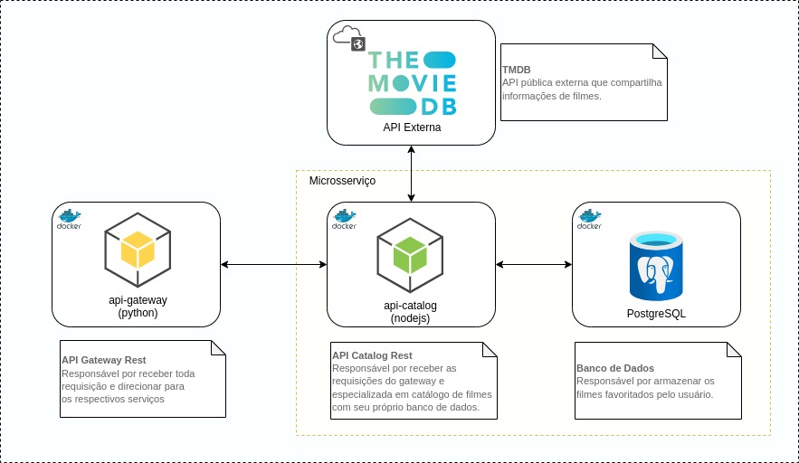

# API de Catálogo de Filmes
**Componente de Microsserviço**

A API utiliza Node.js, Express, PostgreSQL e Swagger para documentação.

## Instruções de Instalação

Siga as etapas abaixo para configurar o ambiente local e iniciar a aplicação.

### Pré-requisitos

- Node.js (versão 14 ou superior)
- Docker
- Docker Compose

### Passo a Passo

1. **Clone o repositório:**

```
git clone https://github.com/heldersantosc/movie-api-catalog.git
cd movie-api-catalog
```

### 1.1. Para executar localmente ###

**Crie o arquivo .env:**

- No diretório raiz do projeto, crie um arquivo .env com as seguintes variáveis:
```
PORT=3000
TMDB_API_KEY=
POSTGRES_USER=user
POSTGRES_PASSWORD=senha
POSTGRES_DB=filmesdb
DATABASE_URL=localhost
```

- Instale as dependências:
```
npm install
```

- Inicie o PostgreSQL com Docker Compose:
Execute o arquivo docker-compose.yml no diretório raiz do projeto 
```
docker compose  -f "docker-compose.yml" up -d --build postgres
```

- Comandos Úteis para rodar localmente
```
npm start
```

### 1.2. Para executar com o docker ###

**Crie o arquivo .env:**

- No diretório raiz do projeto, crie um arquivo .env com as seguintes variáveis:
```
PORT=3000
TMDB_API_KEY=
POSTGRES_USER=user
POSTGRES_PASSWORD=senha
POSTGRES_DB=filmesdb
DATABASE_URL=localhost
```

- Inicie os serviços do Docker com Docker Compose:
Execute o arquivo docker-compose.yml no diretório raiz do projeto 
```
docker compose up -d
```

- Acesse a documentação da API:
Acesse o Swagger UI para visualizar e testar a API em http://localhost:3000/api-docs.


## 1.3. Arquitura dos serviços ##
